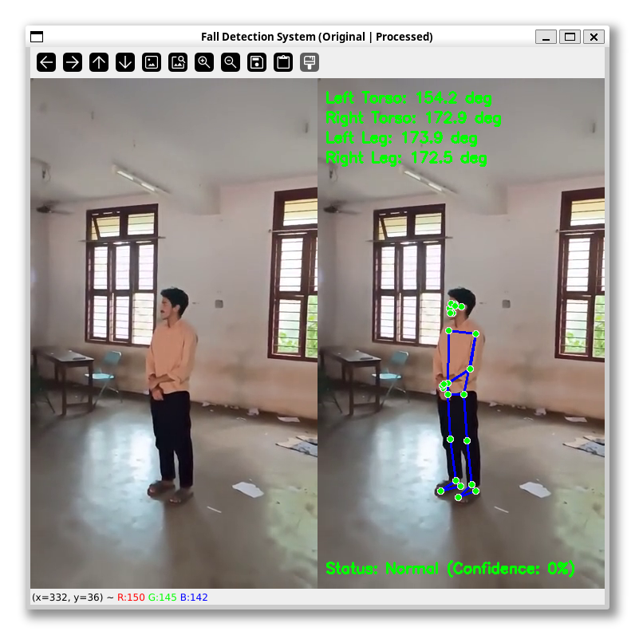
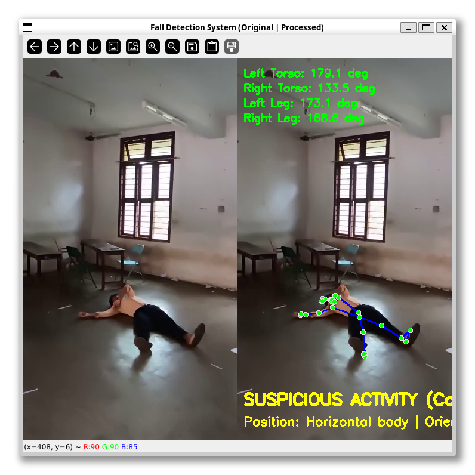
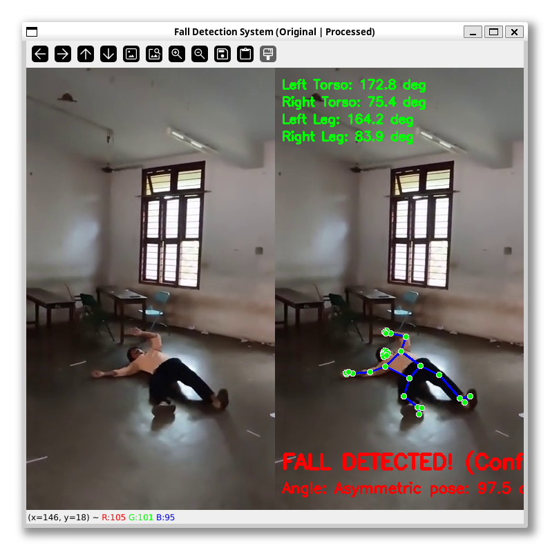

# Elderly Fall Detection System

> [!WARNING]
> Some of the dependency packages used in this project (such as specific versions of `mediapipe`, `opencv-python`, etc.) may be outdated. You may need to update the dependencies in `requirements.txt` to the latest versions and make corresponding changes to the codebase to accommodate any API changes.

A computer vision-based fall detection system using MediaPipe and OpenCV for real-time monitoring of elderly individuals. The system analyzes pose landmarks and movement patterns to detect potential falls and instantly notifies caregivers via the **FallGuard Android app** through Firebase Realtime Database.

## System Architecture

```
fall_detection.py (fall_detection_env)
        ↓
   writes to status.txt
        ↓
firebase_sender.py (firebase_admin_venv)
        ↓
   Firebase Realtime Database
        ↓
   FallGuard Android App
        ↓
   Caregiver's phone alarm triggers
        ↓
   Caregiver presses Acknowledge
        ↓
   Android app writes acknowledged: true to Firebase
        ↓
firebase_sender.py sees acknowledgement
        ↓
   writes ACKNOWLEDGED to status.txt
        ↓
fall_detection.py resumes monitoring
```

## Features

- Real-time pose detection using MediaPipe
- Multi-algorithm fall detection using joint angles (including specific torso/leg tracking and asymmetry), body velocity, and vertical position (including full-body bounding box aspect ratio)
- Live on-screen video feed with side-by-side display (Original vs Processed), real-time skeleton overlay, and confidence status alerts
- Temporal smoothing with a rolling confidence window to reduce false positives
- Tiered alert system — SUSPICIOUS activity and confirmed FALL_DETECTED
- Notification cooldown to prevent alert spam
- Firebase Realtime Database integration for instant caregiver notification
- Fall clip recording — 3 seconds before and after the fall, uploaded to Cloudinary
- Graceful video upload fallback (uploads raw .mp4 directly to Cloudinary if H.264 ffmpeg re-encoding fails)
- Automated stale clip cleanup at startup
- Caregiver acknowledgement flow via FallGuard Android app
- Dual-process architecture with inter-process communication via status.txt
- Single launcher script to start the entire system

## Screenshots

<table>
  <tr>
    <td align="center">
      <br>
      <sub><b>Normal Monitoring State</b></sub>
    </td>
  </tr>
  <tr>
    <td align="center">
      <br>
      <sub><b>Suspicious Activity Escalation</b></sub>
    </td>
  </tr>
  <tr>
    <td align="center">
      <br>
      <sub><b>Fall Detected Alarm Trigger</b></sub>
    </td>
  </tr>
</table>

## Related Repository

**FallGuard** — The companion Android app for caregivers. Receives fall alerts in real time, triggers an alarm, and allows the caregiver to acknowledge the alert.

🔗 [https://github.com/grassy345/FallGuard](https://github.com/grassy345/FallGuard)

## Design Scope

This system is intentionally designed for **single-occupant monitoring environments**. The primary use case is monitoring one elderly individual in their home — a context where multi-person detection is unnecessary and would impose a significant computational overhead without practical benefit.

Multi-person detection was evaluated during development but ruled out as the pose estimation workload for multiple simultaneous subjects is prohibitive on standard consumer hardware, and falls outside the intended deployment scenario of individual elderly home care.

## Prerequisites

- Python 3.7 or higher
- Webcam or USB camera
- Firebase project with Realtime Database enabled
- Cloudinary account (free tier) for fall clip storage
- ffmpeg installed on the system (`sudo apt install ffmpeg` on Ubuntu/WSL)
- FallGuard Android app installed on caregiver's device
- For WSL users: USB camera forwarding setup (see below)

## Project Structure

```
fall_detection_project/
├── fall_detection.py       # Main fall detection application (fall_detection_env)
├── firebase_sender.py      # Firebase bridge and Cloudinary upload script (firebase_admin_venv)
├── launcher.py             # Launches both scripts with their respective environments
├── test_camera.py          # Camera testing utility
├── requirements.txt        # Python dependencies for fall_detection_env
├── serviceAccountKey.json  # Firebase service account key (not tracked in git)
├── cloudinary.env          # Cloudinary credentials (not tracked in git)
├── status.txt              # Inter-process communication bridge (not tracked in git)
├── README.md               # This file
└── .gitignore              # Git ignore rules
```

## Setup Instructions

### 1. Clone the Repository

```bash
git clone https://github.com/grassy345/fall_detection_project
cd fall_detection_project
```

### 2. Set Up the Fall Detection Environment

```bash
python3 -m venv fall_detection_env
source fall_detection_env/bin/activate  # On Windows: fall_detection_env\Scripts\activate
pip install -r requirements.txt
deactivate
```

### 3. Set Up the Firebase Admin Environment

A separate virtual environment is required due to a protobuf version conflict between MediaPipe and Firebase Admin SDK.

```bash
python3 -m venv firebase_admin_venv
source firebase_admin_venv/bin/activate
pip install firebase-admin cloudinary python-dotenv
deactivate
```

### 4. Configure Firebase

1. Go to your [Firebase Console](https://console.firebase.google.com/)
2. Navigate to **Project Settings → Service Accounts**
3. Click **Generate new private key** and save it as `serviceAccountKey.json` in the project root
4. Ensure your Realtime Database has the following structure at `/fall_alert`:

```json
{
  "fall_status": "NORMAL",
  "timestamp": "DD-MM-YYYY HH:MM:SS",
  "acknowledged": false,
  "clip_url": ""
}
```

### 5. Configure Cloudinary

1. Create a free account at [cloudinary.com](https://cloudinary.com)
2. From the Dashboard, note your **Cloud Name**, **API Key**, and **API Secret**
3. Go to **Settings → Upload → Upload Presets** and create an unsigned preset named `fall_detection_preset`
4. Create a `cloudinary.env` file in the project root:

```
CLOUDINARY_CLOUD_NAME=your_cloud_name
CLOUDINARY_API_KEY=your_api_key
CLOUDINARY_API_SECRET=your_api_secret
```

### 6. Install ffmpeg

```bash
sudo apt install ffmpeg   # Ubuntu / WSL
```

### 7. Test Camera Setup

```bash
source fall_detection_env/bin/activate
python test_camera.py
```

### 8. Run the System

```bash
python3 launcher.py
```

This single command starts both `fall_detection.py` and `firebase_sender.py` using their respective environments. Press `Ctrl+C` to stop both processes cleanly.

## How It Works

### Fall Detection (`fall_detection.py`)
1. Captures live video from webcam using OpenCV
2. Runs MediaPipe pose estimation to extract 33 body landmarks per frame
3. Calculates a confidence score every frame using three independent detectors — joint angles (torso/legs and asymmetry), body velocity, and vertical position (including full-body bounding box aspect ratio)
4. Scores are accumulated in a 2-second rolling window (60 frames at 30 FPS)
5. If ≥50% of frames in the window are fall-confidence, status escalates to `FALL_DETECTED`
6. If ≥50% of frames are suspicious-confidence and this occurs twice consecutively, status escalates to `SUSPICIOUS`
7. Status is written to `status.txt` and the escalation block freezes until the caregiver acknowledges
8. A circular frame buffer continuously stores the last 3 seconds of footage — on alert trigger, pre-fall footage is snapshotted and 3 seconds of post-fall footage is recorded, then stitched into `fall_clip.mp4` on a background thread
9. Displays a live side-by-side feed (Original vs Processed) with skeleton overlays, calculated angles, and real-time alerts.

### Firebase Bridge (`firebase_sender.py`)
1. Clears any stale fall clip from previous sessions at startup
2. Polls `status.txt` every 1 second for status changes
3. On `FALL_DETECTED` or `SUSPICIOUS` — writes `fall_status`, `timestamp`, and `acknowledged: false` atomically to Firebase `/fall_alert`
4. Waits for `fall_clip.mp4` to finish writing, re-encodes it to H.264 using ffmpeg (with a graceful fallback to raw mp4 upload if encoding fails), uploads to Cloudinary, and updates `clip_url` in Firebase
5. Switches to polling Firebase `acknowledged` field every 2 seconds
6. When `acknowledged` turns `true` — writes `ACKNOWLEDGED` to `status.txt` and resets Firebase to `fall_status: NORMAL, acknowledged: false`

### Launcher (`launcher.py`)
1. Verifies both Python interpreters exist before starting
2. Starts `fall_detection.py` with `fall_detection_env` interpreter
3. Waits 2 seconds for `status.txt` to initialize
4. Starts `firebase_sender.py` with `firebase_admin_venv` interpreter
5. Monitors both processes — if either crashes, the other is terminated automatically

## WSL Setup (Windows Users)

If you're using WSL2 on Windows, you'll need to forward your USB camera.

**On Windows (PowerShell as Administrator):**
```powershell
winget install usbipd
usbipd list
usbipd attach --wsl --busid <your-camera-busid>
```

**In WSL:**
```bash
sudo apt update
sudo apt install v4l-utils
v4l2-ctl --list-devices  # verify camera is visible
```

## Current Status

- [x] Real-time pose detection and skeleton visualization
- [x] Multi-algorithm fall confidence scoring
- [x] Temporal smoothing with rolling confidence window
- [x] Tiered alert system (SUSPICIOUS / FALL_DETECTED)
- [x] Firebase Realtime Database integration
- [x] Fall clip recording with pre and post fall footage
- [x] H.264 re-encoding via ffmpeg for universal playback
- [x] Cloudinary upload with clip URL delivered to FallGuard via Firebase
- [x] Caregiver acknowledgement flow
- [x] Dual-process launcher with graceful shutdown
- [x] FallGuard Android companion app

## Troubleshooting

### Camera Not Working
- Check if the camera is in use by another application
- Try different camera indices (0, 1, 2) in `test_camera.py`
- For WSL users, ensure USB forwarding is active (`usbipd attach`)

### Firebase Connection Failing
- Verify `serviceAccountKey.json` is present in the project root
- Check that the Database URL in `firebase_sender.py` matches your Firebase project
- Ensure Realtime Database rules allow read/write access

### Cloudinary Upload Failing
- Verify `cloudinary.env` is present in the project root with correct credentials
- Ensure the upload preset name matches exactly — `fall_detection_preset`
- Check that ffmpeg is installed (`ffmpeg -version`)

### Performance Issues
- Lower the camera resolution in `setup_camera()`
- Close other applications using the camera or GPU

### Import Errors
- Ensure you are running scripts through `launcher.py` and not activating environments manually
- Reinstall dependencies in the correct environment

## Development Guidelines

- Follow PEP 8 style guidelines
- Add docstrings to all functions
- Test camera before committing using `test_camera.py`
- Never commit `serviceAccountKey.json`, `cloudinary.env`, or `status.txt` — all are in `.gitignore`
- Keep fall detection logic in `fall_detection_env` and Firebase/Cloudinary logic in `firebase_admin_venv`

## License

This project is open source and available under the [MIT License](LICENSE).

## Acknowledgements

- MediaPipe team for the pose estimation framework
- OpenCV community for computer vision tools
- Firebase team for the Realtime Database SDK
- Cloudinary for free-tier video hosting

## Contact

For questions or suggestions, please open an issue on [GitHub](https://github.com/grassy345/fall_detection_project/issues).

---

**Note**: This is a college major project focused on computer vision and IoT concepts. The system is intentionally scoped for single-occupant monitoring environments and is designed for educational purposes. It should not be used as the sole monitoring solution for elderly care without proper testing and clinical validation.